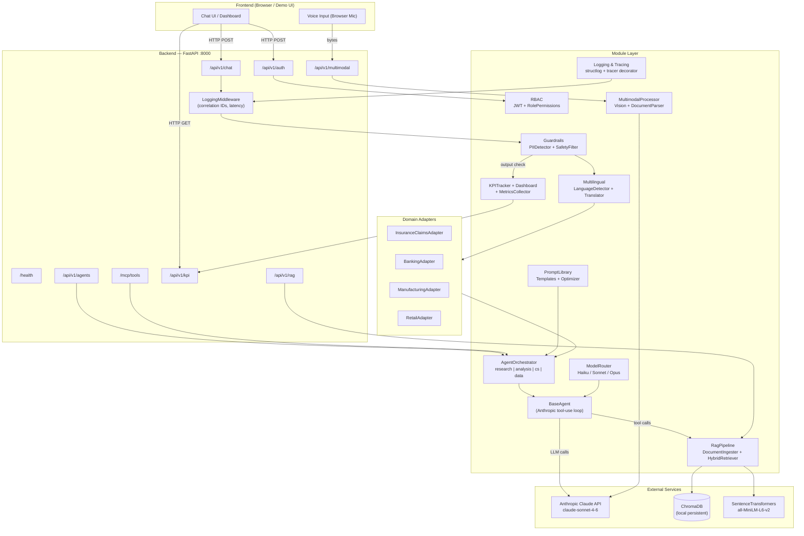
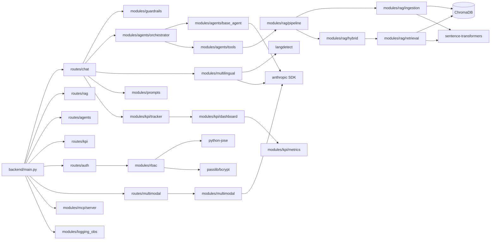

# Enterprise AI Platform — Architecture

TCS Hackathon: Pluggable, production-grade Enterprise AI platform built on FastAPI, Claude (Anthropic SDK), ChromaDB, and SentenceTransformers.

---

## System Architecture Flowchart



---

## Module — Judging Criteria Coverage

| Module | Files | Judging Criteria Covered | Technical Competency |
|---|---|---|---|
| **modules/rag** | ingestion, retrieval, hybrid, pipeline | Knowledge Management, Document Processing | ChromaDB vector store, SentenceTransformers embeddings, BM25 + RRF hybrid search |
| **modules/agents** | base_agent, tools, orchestrator | Agentic AI, Tool Use, Multi-Agent | Anthropic tool-use loop (max 10 iter), keyword-based routing, 5 built-in tools |
| **modules/mcp** | server, client | MCP Protocol Compliance | JSON-RPC 2.0, FastAPI router integration, MCP 2024-11-05 format |
| **modules/rbac** | models, auth, permissions | Security, Enterprise Readiness | JWT (python-jose), bcrypt (passlib), role-permission matrix, FastAPI deps |
| **modules/guardrails** | pii_detector, safety_filter, pipeline | Safety, Responsible AI | Regex PII (Aadhaar, PAN, Email, Phone), prompt-injection detection, output scrubbing |
| **modules/kpi** | tracker, metrics, dashboard | Business Impact, ROI | Singleton tracker, domain-specific KPIs (insurance/banking/mfg/retail), ROI calculator |
| **modules/prompts** | templates, library, optimizer | Prompt Engineering | Few-shot + CoT templates, 4 domain system prompts, LLM-as-judge A/B optimizer |
| **modules/multimodal** | processor, document_parser | Multimodal AI | Claude vision (base64), 6 task types (damage/invoice/id/qc), pdfplumber tables |
| **modules/logging_obs** | structured, tracer, exceptions | Observability, Production Quality | structlog JSON, correlation IDs, decorator-based tracing, typed HTTP exceptions |
| **modules/voice** | interface | Accessibility, Multimodal | Whisper API integration, browser TTS fallback |
| **modules/multilingual** | language | Global Reach | langdetect + Claude translation, 10 languages, domain term preservation |
| **modules/model_router** | router | Cost Optimization | Complexity-based Haiku/Sonnet/Opus routing, per-model cost tracking |
| **adapters/insurance_claims** | adapter | Domain Depth, Vertical AI | Fraud detection prompts, IRDAI compliance, settlement calculation, 5 KPIs |
| **adapters/banking** | adapter | Domain Depth, Vertical AI | Fraud alerts, KYC/AML compliance, RBI guidelines |
| **adapters/manufacturing** | adapter | Domain Depth, Vertical AI | Six Sigma/DMAIC, ISO 9001, defect classification |
| **adapters/retail** | adapter | Domain Depth, Vertical AI | Recommendation CTR, basket size KPIs, consumer protection |
| **backend/main** | main, config | System Integration | FastAPI CORS, startup hooks, global exception handlers |
| **backend/api/routes** | chat, rag, agents, kpi, auth, multimodal | API Design | Async routes, Pydantic request/response models, file uploads |

---

## Module Dependency Graph



---

## Quick Start

### Prerequisites
- Python 3.11+
- An Anthropic API key

### 1. Clone and configure

```bash
cd /home/user/Fridaynight
cp .env.example .env
# Edit .env and set your ANTHROPIC_API_KEY
```

### 2. Install dependencies

```bash
pip install -r requirements.txt
```

### 3. Run the server

```bash
uvicorn backend.main:app --host 0.0.0.0 --port 8000 --reload
```

### 4. Verify it works

```bash
curl http://localhost:8000/health
# {"status":"ok","version":"1.0.0","adapter":"insurance_claims"}
```

### 5. Login and get a token

```bash
curl -X POST http://localhost:8000/api/v1/auth/login \
  -H "Content-Type: application/json" \
  -d '{"username":"admin","password":"admin123"}'
```

### 6. Send a chat message

```bash
TOKEN="<paste token here>"
curl -X POST http://localhost:8000/api/v1/chat \
  -H "Authorization: Bearer $TOKEN" \
  -H "Content-Type: application/json" \
  -d '{"message":"What is the status of claim CLM-2024-001?","adapter":"insurance_claims"}'
```

### 7. Run with Docker

```bash
docker-compose up --build
```

### 8. Run tests

```bash
pytest modules/ backend/tests/ -v
```

---

## Domain Adapter Selection

Switch adapters by setting `ACTIVE_ADAPTER` in `.env` or passing `adapter` in the chat request body:

| Adapter Key | Domain | Key Features |
|---|---|---|
| `insurance_claims` | Insurance Claims Processing | Fraud detection, settlement calc, IRDAI compliance |
| `banking` | Banking & Financial Services | Account queries, fraud alerts, RBI/KYC/AML |
| `manufacturing` | Manufacturing Quality Control | Defect detection, Six Sigma, ISO 9001 reports |
| `retail` | Retail & E-Commerce | Product recommendations, order management, promotions |

---

## Demo Users (pre-seeded)

| Username | Password | Role | Permissions |
|---|---|---|---|
| admin | admin123 | ADMIN | All permissions |
| analyst | analyst123 | ANALYST | Read, Write, Run Agent, View KPI, Ingest Docs |
| viewer | viewer123 | VIEWER | Read Data, View KPI |

---

## API Endpoints Summary

| Method | Path | Description |
|---|---|---|
| GET | `/health` | Health check |
| POST | `/api/v1/auth/login` | Login, get JWT |
| POST | `/api/v1/auth/me` | Get current user info |
| POST | `/api/v1/chat` | Main AI chat endpoint |
| POST | `/api/v1/rag/ingest` | Upload PDF/text to knowledge base |
| POST | `/api/v1/rag/query` | Query knowledge base |
| POST | `/api/v1/agents/run` | Run a specific agent |
| GET | `/api/v1/agents/list` | List available agents |
| GET | `/api/v1/kpi/dashboard` | Full KPI dashboard data |
| GET | `/api/v1/kpi/metrics` | Raw agent metrics |
| POST | `/api/v1/multimodal/analyze` | Analyze image with Claude vision |
| POST | `/mcp/tools/list` | MCP tool listing (JSON-RPC) |
| POST | `/mcp/tools/call` | MCP tool execution (JSON-RPC) |
