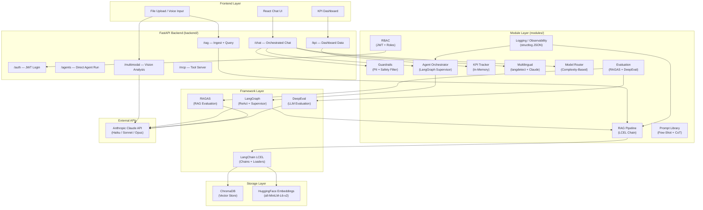

# Enterprise AI Platform — TCS Hackathon Architecture

## System Architecture



## Module to Judging Criteria Mapping

| Module | Framework Used | Judging Criteria | Technical Competency |
|--------|---------------|------------------|----------------------|
| `modules/rag/` | LangChain LCEL, LangChain-Chroma, HuggingFace Embeddings | RAG Quality, Knowledge Retrieval | Vector search, hybrid BM25+vector, chunking strategies |
| `modules/agents/` | LangGraph `create_react_agent`, LangChain Tools | Agentic Reasoning, Tool Use | ReAct loop, multi-agent supervisor, dynamic routing |
| `modules/evaluation/` | RAGAS (faithfulness, relevancy, precision, recall), DeepEval (hallucination, toxicity) | Evaluation Rigor, Quality Assurance | LLM-as-judge, metric computation, automated testing |
| `modules/kpi/` | Custom (structlog observability) | Business Impact, ROI | KPI tracking, cost estimation, domain metrics |
| `modules/prompts/` | LangChain `ChatPromptTemplate`, `FewShotChatMessagePromptTemplate` | Prompt Engineering | Few-shot, CoT, A/B testing, LLM judge |
| `modules/model_router/` | LangChain-Anthropic | Cost Optimization | Complexity-based routing, cost tracking |
| `modules/guardrails/` | Custom (PII detection, safety) | Safety and Compliance | Input/output filtering, PII redaction |
| `modules/rbac/` | python-jose JWT, passlib | Security | Role-based access, JWT auth |
| `modules/multilingual/` | langdetect, LangChain-Anthropic | Accessibility, Reach | Language detection, translation |
| `modules/multimodal/` | Anthropic Claude Vision | Multimodal AI | Image analysis, document extraction |
| `modules/mcp/` | FastAPI APIRouter (MCP protocol) | Interoperability | Tool server, JSON-RPC 2.0 |
| `adapters/` | Dataclass adapters | Domain Adaptability | Plug-and-play domain configs |
| `backend/` | FastAPI, Pydantic v2, uvicorn | Production Readiness | REST API, middleware, exception handling |

## Quick Start

### 1. Install Dependencies
```bash
pip install -r requirements.txt
```

### 2. Configure Environment
```bash
cp .env.example .env
# Edit .env and set:
# ANTHROPIC_API_KEY=sk-ant-...
# ACTIVE_ADAPTER=insurance_claims   # or banking, manufacturing, retail
```

### 3. Start the Backend
```bash
uvicorn backend.main:app --reload --host 0.0.0.0 --port 8000
```

### 4. Start the Frontend
```bash
cd frontend
npm install
npm run dev
```

### 5. Run Evaluation Tests
```bash
pytest modules/evaluation/tests/ -v
pytest modules/rag/tests/ -v
pytest modules/agents/tests/ -v
```

### 6. Docker (Full Stack)
```bash
docker-compose up --build
```

---

## Hackathon Day Playbook — Configure for a Domain in 30 Minutes

### Step 1 — Choose Your Domain (2 min)
Edit `.env`:
```env
ACTIVE_ADAPTER=insurance_claims   # Options: insurance_claims | banking | manufacturing | retail
ANTHROPIC_API_KEY=sk-ant-...
```

### Step 2 — Ingest Domain Documents (5 min)
Drop your PDF/TXT knowledge base files and run:
```bash
curl -X POST http://localhost:8000/api/v1/rag/ingest \
  -F "file=@your_domain_docs.pdf"
```
Or use the frontend File Upload component.

### Step 3 — Customize System Prompt (5 min)
Edit `modules/prompts/library.py` — update the `DOMAIN_SYSTEM_PROMPTS` dict for your domain. Or create a new entry. The prompt defines agent persona, responsibilities, and response format.

### Step 4 — Add Domain-Specific Sample Data (5 min)
Edit the adapter at `adapters/<your_domain>/adapter.py`:
- Update sample data constants with your demo records
- Update `sample_questions` list with realistic user queries
- Update `kpi_definitions` with your domain KPIs

### Step 5 — Wire Up KPI Cards (3 min)
Edit `modules/kpi/metrics.py` — add your domain key under `domain_specific` in `compute_business_kpis()`. The frontend KPI Dashboard auto-renders whatever keys you return.

### Done! Test It
```bash
curl -X POST http://localhost:8000/api/v1/chat \
  -H "Content-Type: application/json" \
  -d '{"message": "What is the status of my claim?", "adapter": "insurance_claims"}'
```

---

## Key Design Decisions

- **LangGraph over raw loops**: `create_react_agent` handles the ReAct tool-use loop with proper state management, replacing 100+ lines of manual Anthropic SDK loop code.
- **LangChain LCEL for RAG**: The pipeline uses `RunnablePassthrough` and `|` composition for clean, inspectable chains — easy to add caching, tracing, or fallbacks.
- **RAGAS + DeepEval dual evaluation**: RAGAS measures retrieval quality (faithfulness, precision, recall); DeepEval measures LLM output quality (hallucination, toxicity, bias). Both run without human annotation.
- **Hybrid BM25 + Vector RRF**: Pure vector search misses keyword-heavy queries (IDs, names). BM25 catches these. RRF fusion gives best of both.
- **Model Router**: Routes to Haiku for simple queries (saves ~12x cost), Sonnet for standard, Opus for complex reasoning — critical for production cost management.
- **Adapter Pattern**: Each domain is a self-contained config object. Swap `ACTIVE_ADAPTER` in `.env` and the entire platform reconfigures — prompts, KPIs, sample data, tools.
